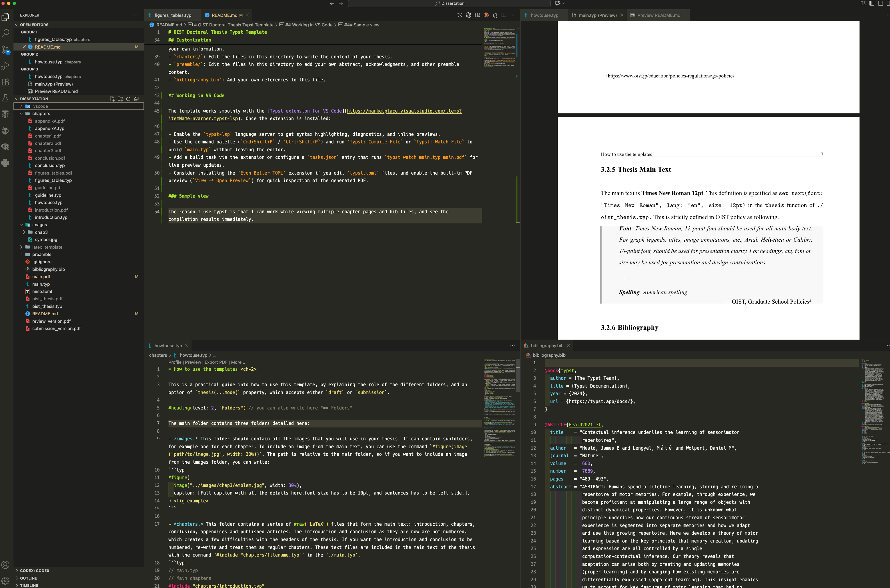

# [Unofficial] OIST Doctoral Thesis Typst Template

This is a Typst template for writing a doctoral thesis at the Okinawa Institute of Science and Technology graduate university (OIST).

**This template has NOT received any approval from the OIST GS Examination team. It is NOT officially supported.** In other words, it is an unofficial template created by me personally.
During meetings, I showed the PDF created using this template and incorporated several suggested revisions. However, I reiterate that since this is not an official OIST template, it may not be correct.

If you find any updates or fixes, please contact me (k.takada@oist.jp). You can also use the Issues or Pull Requests in this repository.

## What is Typst?

Faster than latex (in my opinion.) Easier to set up a local environment than LaTeX (in my opinion.)

Typst is a modern, markup-based typesetting system designed to feel as approachable as Markdown while offering the layout control of LaTeX. Documents are written in plain text, compiled with the open-source `typst` tool, and can make full use of reusable components, scripting, and styling primitives. You can learn more at the official documentation: [https://typst.app/docs/](https://typst.app/docs/)

## Prerequisites

You need to install Typst. You can find the installation instructions for your operating system on the official Typst website: [https://typst.app/docs/guide/install/](https://typst.app/docs/guide/install/)

## Usage

To compile the thesis, run the following command in your terminal:

```bash
typst compile main.typ
```

This will generate a PDF file named `main.pdf` in the same directory.

## Structure

- `main.typ`: The main file for your thesis. It imports all the necessary files and sets up the document structure.
- `oist_thesis.typ`: The core template file. It defines the `thesis` function, which sets up the title page, headers, and other document-wide settings.
- `chapters/`: This directory contains the individual chapters of your thesis. You can add, remove, or rename files in this directory as needed.
- `preamble/`: This directory contains the preamble files, such as the abstract, acknowledgments, and declaration.
- `images/`: This directory contains the images used in your thesis.
- `bibliography.bib`: The bibliography file for your thesis. You can add your own references to this file.

## Customization

To customize your thesis, you will need to edit the following files:

- `main.typ`: Change the `title`, `author`, `supervisor`, `cosupervisor`, and `submission_date` variables to match your own information.
- `chapters/`: Edit the files in this directory to write the content of your thesis.
- `preamble/`: Edit the files in this directory to add your own abstract, acknowledgments, and other preamble content.
- `bibliography.bib`: Add your own references to this file.

## Working in VS Code

The template works smoothly with the [Typst extension for VS Code](https://marketplace.visualstudio.com/items?itemName=nvarner.typst-lsp). Once the extension is installed:

- Enable the `typst-lsp` language server to get syntax highlighting, diagnostics, and inline previews.
- Use the command palette (`Cmd+Shift+P` / `Ctrl+Shift+P`) and run `Typst: Compile File` or `Typst: Watch File` to build `main.typ` without leaving the editor.
- Add a build task via the extension or configure a `tasks.json` entry that runs `typst watch main.typ main.pdf` for live preview updates.
- Consider installing the `Even Better TOML` extension if you edit `typst.toml` files, and enable the built-in PDF preview (`View → Open Preview`) for quick inspection of the generated PDF.

### Sample view

The reason I use typst is that I can work while viewing multiple chapter pages and bib files, and see the compilation results immediately.
